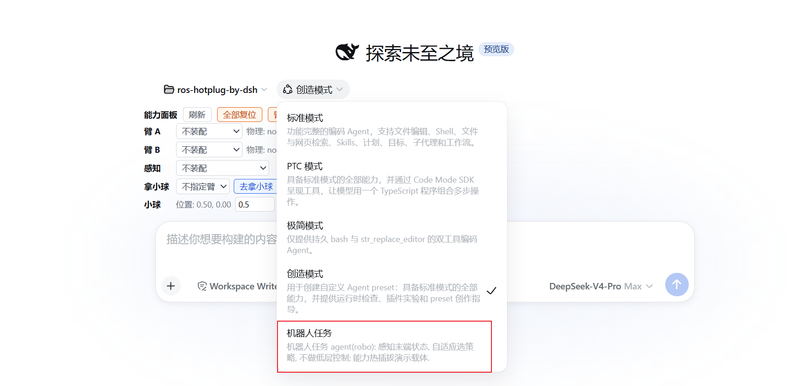
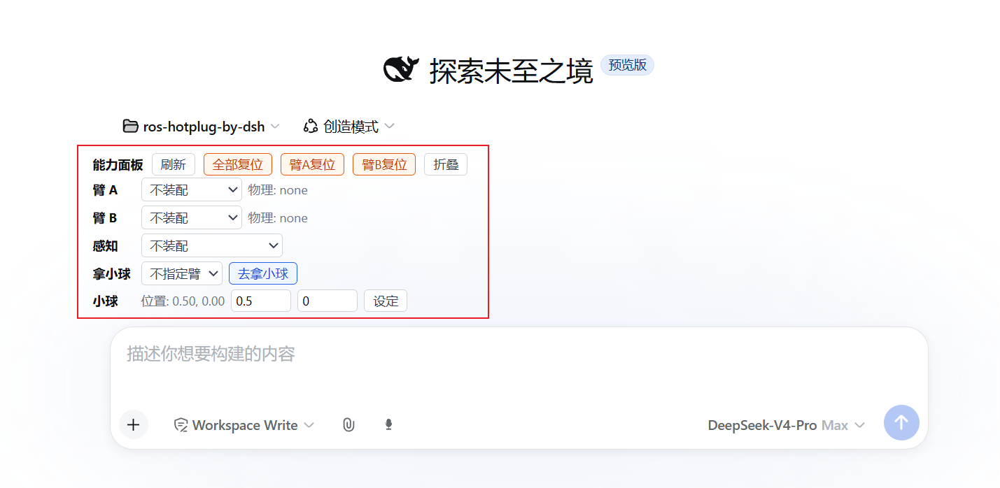
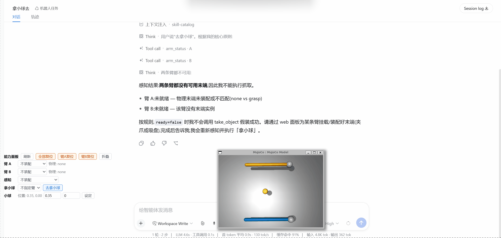
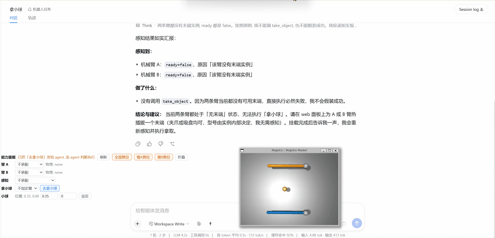
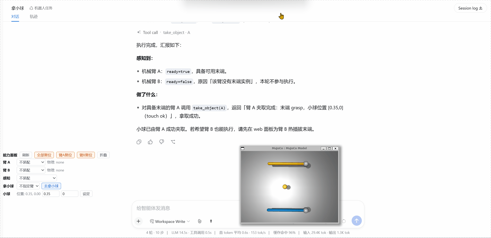

[中文](README.zh.md) | English

# ros-hotplug-by-dsh

English | [中文](README.zh.md)

> **One-liner**: Be the first to apply DeepSeek Harness (DSH) *spatiotemporal compositionality* to **hot-plugging of embodied-robot capabilities**, with a **reproducible implementation + tutorial-grade demos**.

---

# Environment setup

1. **Robot side (ROS2 + simulation)**
   - Terminal 1: `ros2 launch rosbridge_server rosbridge_websocket_launch.xml` (rosbridge channel)
   - Terminal 2: `source /opt/ros/humble/setup.bash && source /root/venvs/robo/bin/activate`, then run `python3 src/ros2/sim_bridge/sim_bridge/two_arm_server.py --view` (two-arm MuJoCo view)

2. **DSH web (panel & capability system)**
   - `bash src/setup.sh` one-shot installs the mount-service row, the capability panel package, and the robo preset (path centralization)
   - Restart `dsh web`; after the page refreshes, the **capability panel** appears above the input area

3. **Create a session**
   - Pick "机器人任务" (Robot Task) → a minimal-toolset robot agent (arm_status/take_object + capability panel)

---

# Scenario examples

## Create a session

Click "机器人任务" (Robot Task) to create a minimal-toolset session. The in-session agent has exactly two robot tools: `arm_status` (perceive whether an arm has a usable end-effector) and `take_object` (have the arm take the object).

## Web capability panel

The red-outlined area is the robot capability panel: mount different end-effector plugins and the vision sensor.

Top-down layout:
- **Actions row**: refresh | reset all | reset arm A | reset arm B | collapse (one row when collapsed)
- **Arm rows**: a dropdown per arm ("no assembly" / each end-effector version), with the physical tip state at the end
- **Perception row**: dropdown ("no assembly" / camera_detect and other sensor capabilities)
- **Take-ball row**: choose "any arm / arm A / arm B" + "take the ball" (sends the message to the agent, which decides and executes)
- **Ball row**: current ball position + x/y inputs + "set" (the ball moves immediately)

## Mount an end-effector

- By clicking in the web UI you can smoothly mount different end-effector plugins
- Arm A (deep blue), arm B (orange), gripper (teal), suction cup (magenta), no assembly (light gray)

## Plugin switching & grabbing the ball

- The agent only cares whether an end-effector is mounted, not how it is implemented (hardware shielding). Once mounted, sending the agent a message triggers the grab: "have arm A take the ball" → the agent calls `arm_status(A)` (ready) → `take_object(A)` (strategy inside the end-effector instance) → hit/miss result.
- The take-ball row also supports "any arm": send "take the ball" and let the agent choose by itself.

## Capability enhancement

- With only grasp 1.2.0, the tip does **blind grabbing**: it moves to that arm's preset point (arm A [0.3,-0.3], arm B [0.3,0.3]); if the ball is not there, the result is "miss".
- Mounting camera_detect on the perception slot makes the vision interceptor inject the ball position into the execution chain → the tip **precisely grabs** the actual position.
- Unmounting the vision sensor falls back to blind grabbing; when vision data is unavailable the chain fails open and the grab flow continues.

---

# Limitations & extensions

## Limitations

- To spotlight the plugin idea, the robot side is deliberately minimal: no physical contact, the grab check is a tip-ball distance threshold (0.05 m, not contact judgment); the simulated vision reads the `ball` field from the /joint_state feedback, not a real camera.
- grasp 1.0.0/1.1.0 and suction 1.0.0 are version-swap demo versions (`touch` publish-and-return, no hit check); the vision injection chain only works with grasp 1.2.0.
- The panel's /cap-mount write path is unauthenticated, targeting a single-user trusted environment.

## Extensions

- Standard protocol & legality checks for capability loading (sha256 admission + kind routing already in place): add publisher signatures and machine-readable capability metadata.
- Logic-vs-physics reconciliation: rebuild mount records from the physical state on panel refresh / mount-service startup (a "rebuild mounts" action).
- Real hardware (ros2_control hardware_interface) and a real vision camera; contact judgment and the ball following the end-effector once grasped, giving "success rate" physical meaning.
- Multi-user authentication, zero-window swap (blue-green two-phase), and automated agent evaluation (agent vs oracle vs random).
